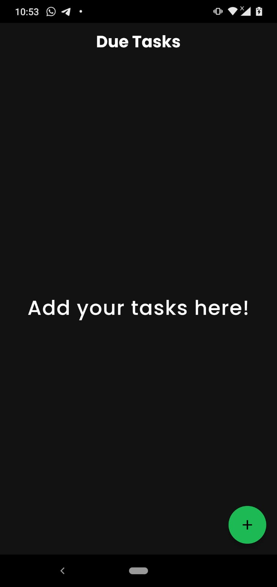
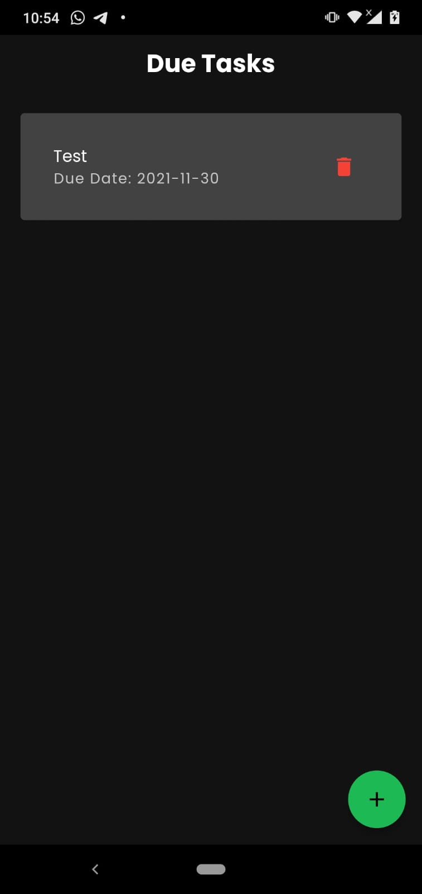
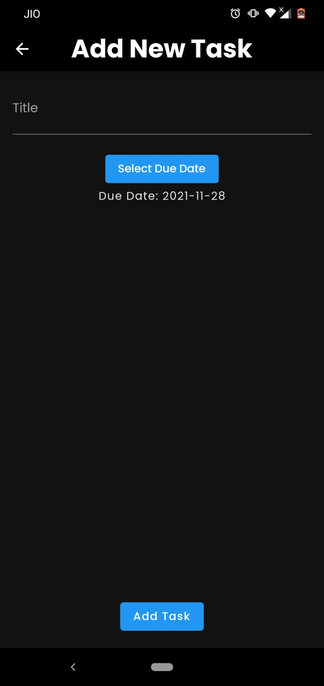
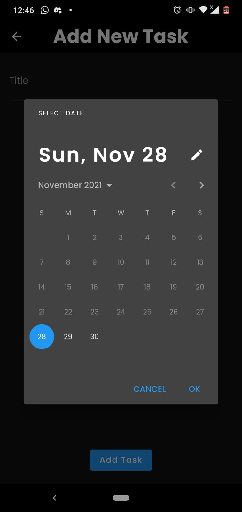

### Task Manager App

This task manager application uses local persistent data storage for storing information about new due tasks. The user has the freedom to add new tasks and delete a task if it gets completed or if the task is unnecessary.

This application has been built to help users to manage their tasks and deadlines efficiently. This application has  a minimalistic User Interface, and local persistent data storage.

For the local data Storage, SQLite database has been used.

User Interface of the application :-

| Screen | Image |
| ------ | ----- |
| Home Screen / Due Tasks List Screen when List is Empty |  |
| Home Screen / Due Tasks List Screen |  |
| Add Task Screen |  |
| Date Picker Screen |  |